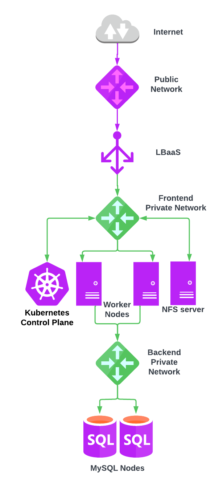

# Getting started with UpCloud Kubernetes Service & Web Apps

Please note that this is just an example on how you can use Terraform with [UpCloud](https://upcloud.com/) and should not be used in production as is. Please see [LICENSE](LICENSE) for details.

This is a demo project about how to set up UpCloud Kubernetes Service cluster using
[Terraform](https://www.terraform.io/) and then deploy WordPress as an example application. Data is
persisted into a UpCloud Managed Database (MySQL) instance.

The created server infrastructure is portrayed in the following diagram:



## Setup up the tooling

Before testing this project you should have the following tools installed on your machine:

- Terraform
- kubectl

To create the resources with Terraform, you'll need your API credentials exported.

```
export UPCLOUD_USERNAME=your_username
export UPCLOUD_PASSWORD=your_password
```

You must also create config.tfvars file with your own settings:

```
ssh_key_public = "ssh-rsa AAAA_YOUR_SSH_PUBLIC_KEY"
zone           = "de-fra1"
worker_count   = 2
worker_plan    = "2xCPU-4GB"
mysql_plan     = "1x1xCPU-2GB-25GB"
uks_network    = "172.16.255.0/24
```

## Deploy cloud resources

Initiate the project and install required Terraform providers.

```
make init
```

The demo can now be created with Terraform. We will deploy a UKS cluster with the given configuration and
a MySQL database. Creation takes around 10-15 minutes.

First, create a plan and see all the resources Terraform is about to create:

```
make plan
```

Then apply the changes:

```
make apply
```

After Terraform has completed the operation, you need to export kubeconfig as an environment
variable:

```
export KUBECONFIG=$(pwd)/terraform/kubeconfig.yml
```

You can monitor active worker node status with `kubectl` as follows:

```
kubectl get nodes --watch=true
```

When all worker nodes are up we will continue by deploying Wordpress into the cluster.

### Deploy WordPress to UKS

As an example, we'll deploy a [WordPress](https://github.com/WordPress/WordPress) instance.
We will use UpCloud's Managed Database for persisting the data. You will first need to create a Kubernetes
secret for storing the required MySQL credentials. These will be used by WordPress. Run the following
command:

```
kubectl create secret generic mysql \
--from-file=user=terraform/credentials/mysql-user.txt \
--from-file=password=terraform/credentials/mysql-password.txt \
--from-file=database=terraform/credentials/mysql-db-name.txt \
--from-file=hostname=terraform/credentials/mysql-hostname.txt
```

Then create a persistent volume with the UpCloud CSI driver:

```
kubectl create -f manifests/wordpress/upcloud-csi-volume.yaml
```

Next, deploy Wordpress and use the volume we just created:

```
kubectl create -f manifests/wordpress/wordpress-deployment.yaml
```

The system then prepares you a load balancer, through which Wordpress is exposed.
You can run the following command and wait until the `EXTERNAL-IP` field has been updated.

```
$ kubectl get services --watch=true
NAME         TYPE           CLUSTER-IP     EXTERNAL-IP   PORT(S)        AGE
kubernetes   ClusterIP      10.128.0.1     <none>        443/TCP        23m
wordpress    LoadBalancer   10.134.19.53   <pending>     80:30591/TCP   12s
```

After a few minutes your load balancer should be up:

```
$ kubectl get services --watch=true
NAME         TYPE           CLUSTER-IP      EXTERNAL-IP                                           PORT(S)          AGE
wordpress    LoadBalancer   10.128.90.14    lb-0a372fcc11e14cb9b9cced602c85c36a-1.upcloudlb.com   80:31033/TCP 
```

Finally, verify that you can access the service through the hostname in `EXTERNAL-IP` with a browser.
For quick validation you can also use `curl`:

```
$ curl -i https://lb-0a372fcc11e14cb9b9cced602c85c36a-1.upcloudlb.com
```

You can then finish the WordPress installation process - and you are done!

## Destroy resources

***NOTE: This will destroy all resources and data involved in this test***

After testing things it's good to free the resources. Once you are absolutely sure you are ready to cleanup you 
can run the following commands to do so:


```
kubectl delete -f manifests/wordpress
make destroy
```

## Additional information

For additional tests, please see the following:

- [Setting up monitoring to your UKS cluster](docs/monitoring.md)
- [Wordpress with shared NFS volumes](docs/wordpress-with-nfs.md)

If you want to dig deeper into various other tutorials, please see the
[uks-instructions](https://github.com/UpCloudLtd/uks-instructions) repository. It has examples of:

- customising the load balancer
- storage operations for backing up data through snapshots and cloning
- more Terraform examples

## License

This project is licensed under the MIT License - see the [LICENSE.md](LICENSE.md) file for details.
