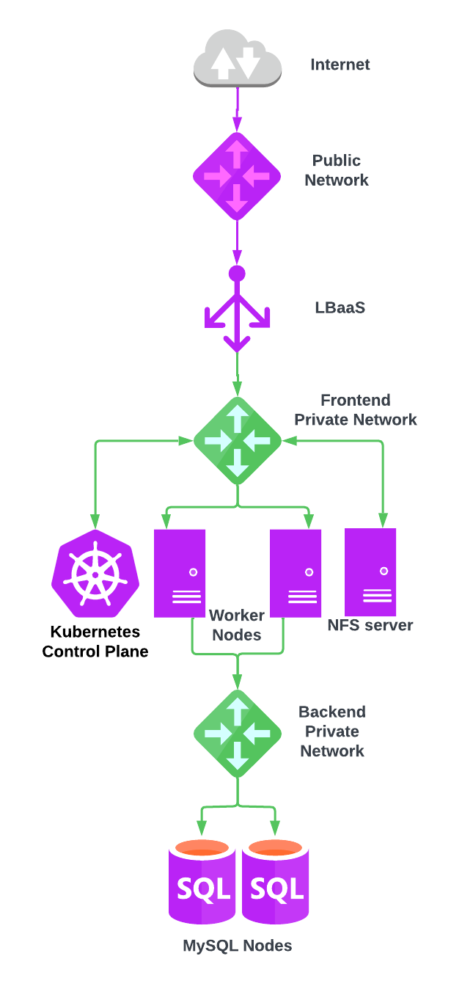

# UpCloud Kubernetes Service Examples

Please note that this is just an example on how you can use Terraform with [UpCloud](https://upcloud.com/) and should not be used in production as is. Please see [LICENSE](LICENSE) for details.

This is a demo project about how to set up UpCloud Kubernetes Service cluster using Terraform and then deploy
WordPress as an example application. This demo uses [Terraform](https://www.terraform.io/) as the IaC tool
for fast deployment.

The created server infrastructure is portrayed in the following picture:



### Prerequisites

Before testing this project you should have Terraform installed on the machine you want to
use for testing. We're also using UpCloud's Terraform provider,
but it should be automatically installed by running `terraform init` (`make init`).

To create the resources with Terraform, you'll need your API credentials exported.

```
export UPCLOUD_USERNAME=your_username
export UPCLOUD_PASSWORD=your_password
```

You must also create config.tfvars file with your own settings:

```
ssh_key_public = "ssh-rsa AAAA_YOUR_SSH_PUBLIC_KEY"
zone           = "de-fra1"
worker_count   = 2
worker_plan    = "2xCPU-4GB"
mysql_plan     = "1x1xCPU-2GB-25GB"
uks_network    = "172.16.255.0/24
```

### Getting started

Initiate the project and install providers.

```
make init
```

The demo can now be created with Terraform. Creation takes around 10-15 minutes.

```
make create
```

### Testing UKS

After Terraform finishes, you need to export kubeconfig as an environment variable `export KUBECONFIG=kubeconfig.yml`.
After the UKS control-plane has been created, it will start creating worker nodes. You can monitor node status with `kubectl`.

```
kubectl get nodes
```

When all worker nodes are up, you can start testing UKS with whatever application you want, but we have provided here few examples.

#### Hello UKS example

This is a simple web app that can be used to test UKS functionality.
Create a deployment and expose it to the public Internet over HTTP by running the following commands:

```
kubectl create deployment --image=ghcr.io/upcloudltd/hello hello-uks
kubectl expose deployment hello-uks --port=80 --target-port=80 --type=LoadBalancer
kubectl get svc -w
```

This process will take a few minutes, as our system will create a new load balancer to handle the traffic.

You can verify that it works by accessing LoadBalancer hostname in your browser or using
`curl <Loadbalancer hostname>` command.

If you want to expose the service over HTTPS instead, run the following:

```
kubectl expose deployment hello-uks --port=443 --target-port=80 --type=LoadBalancer --name=hello-uks-https
```

We provision a TLS certificate automatically for the autogenerated Load Balancer hostname.

#### Monitoring example

You might want to deploy monitoring to see how cluster resources are used during testing.
We can use the kube-prometheus project for fast and easy deployment for testing.

First clone the kube-prometheus project from Github.

```
git clone https://github.com/prometheus-operator/kube-prometheus.git
```

And then deploy it to the UKS cluster.

```
kubectl apply --server-side -f kube-prometheus/manifests/setup
kubectl wait \
	--for condition=Established \
	--all CustomResourceDefinition \
	--namespace=monitoring
kubectl apply -f kube-prometheus/manifests/
```

The kube-prometheus project includes multiple components, but for now we want to just access Grafana dashboards.
For testing purposes, the easy way to access Grafana is to use port-forwarding from your local computer localhost.

```
 kubectl --namespace monitoring port-forward svc/grafana 3000
```

Then access via [http://localhost:3000](http://localhost:3000) and use the default grafana user:password of `admin:admin`.

Kube-prometheus was deployed to the namespace <i>"monitoring"</i>, so you need to use `-n monitoring` parameter when viewing objects in the <i>monitoring</i> namespace. For example:

```
kubectl get svc -n monitoring
NAME                    TYPE        CLUSTER-IP       EXTERNAL-IP   PORT(S)                      AGE
alertmanager-main       ClusterIP   10.138.206.96    <none>        9093/TCP,8080/TCP            47m
alertmanager-operated   ClusterIP   None             <none>        9093/TCP,9094/TCP,9094/UDP   46m
blackbox-exporter       ClusterIP   10.128.106.240   <none>        9115/TCP,19115/TCP           47m
grafana                 ClusterIP   10.129.214.97    <none>        3000/TCP                     47m
kube-state-metrics      ClusterIP   None             <none>        8443/TCP,9443/TCP            47m
node-exporter           ClusterIP   None             <none>        9100/TCP                     47m
prometheus-adapter      ClusterIP   10.131.13.100    <none>        443/TCP                      47m
prometheus-k8s          ClusterIP   10.138.100.82    <none>        9090/TCP,8080/TCP            47m
prometheus-operated     ClusterIP   None             <none>        9090/TCP                     46m
prometheus-operator     ClusterIP   None             <none>        8443/TCP                     47m
```

#### WordPress example

The next application is [WordPress](https://github.com/WordPress/WordPress) - to start you need to
create a kubernetes secret for storing MySQL credentials. These will be used by the WordPress application we deploy.
You can do this by running the following command, as Terraform already has stored credentials in separate files.

```
kubectl create secret generic mysql \
--from-file=user=credentials/mysql-user.txt \
--from-file=password=credentials/mysql-password.txt \
--from-file=database=credentials/mysql-db-name.txt \
--from-file=hostname=credentials/mysql-hostname.txt
```

Then you need to create persistent volume with the UpCloud CSI driver

```
kubectl create  -f wordpress-example/upcloud-csi-volume.yaml
```

Then you can deploy WordPress which uses the volume we just created

```
kubectl create  -f wordpress-example/wordpress-deployment.yaml
```

After this you should verify that your WordPress service is up.

```
$ kubectl get services
NAME         TYPE           CLUSTER-IP      EXTERNAL-IP                                           PORT(S)          AGE
wordpress    LoadBalancer   10.128.90.14    lb-0a372fcc11e14cb9b9cced602c85c36a-1.upcloudlb.com   80:31033/TCP   4m1s
```

Then access the hostname under EXTERNAL-IP with a browser to finish the WordPress install.

### WordPress with NFS Example

First, you might want to delete the previous WordPress deployment as this one uses the same MySQL database. You can do this with

```
kubectl delete -f wordpress-example/wordpress-deployment.yaml
kubectl delete -f wordpress-example/upcloud-csi-volume.yaml
```

To get started with NFS you need to deploy nfs-provisioner. You can do that with the commands below, but you need to fill
in the <nfs-server-ip> from Terraform. You can use command `make print` to output the NFS server IP.

```
helm repo add nfs-subdir-external-provisioner https://kubernetes-sigs.github.io/nfs-subdir-external-provisioner
helm install nfs-subdir-external-provisioner nfs-subdir-external-provisioner/nfs-subdir-external-provisioner \
  --create-namespace \
  --namespace nfs-provisioner \
  --set nfs.server=<nfs-server-ip> \
  --set nfs.path=/data
```

Then you need to install an NFS client to worker nodes as they do not have it by default. You can do this via SSH or
with the provided bash script `bash install-nfs-client-to-workers.sh`

Then you can deploy WordPress that uses an NFS server as a persistent volume.

```
kubectl create  -f wordpress-example/wordpress-with-nfs.yaml
```

Once again you access the hostname under EXTERNAL-IP with browser to finish the WordPress install.

```
$ kubectl get services
NAME              TYPE           CLUSTER-IP       EXTERNAL-IP                                           PORT(S)         AGE
wordpress-nfs     LoadBalancer   10.129.156.204   lb-0a3fc4da7b7d4d1c8a99dbbdaea23d90-1.upcloudlb.com   80:31992/TCP    42m
```

### Destroying resources

After testing things it's good to free the resources. Tearing the whole thing down is also just one command.

```
kubectl delete deployment hello-uks
kubectl delete svc hello-uks
kubectl delete svc hello-uks-https
kubectl delete -f kube-prometheus/manifests/
kubectl delete -f wordpress-example/
make destroy
```

### License

This project is licensed under the MIT License - see the [LICENSE.md](LICENSE.md) file for details.
